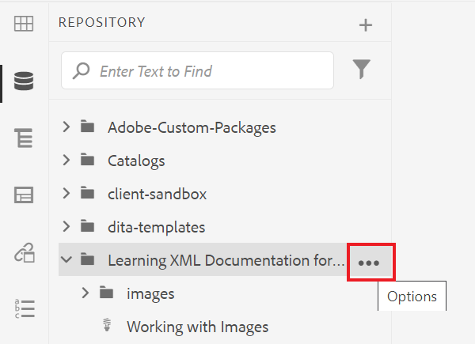
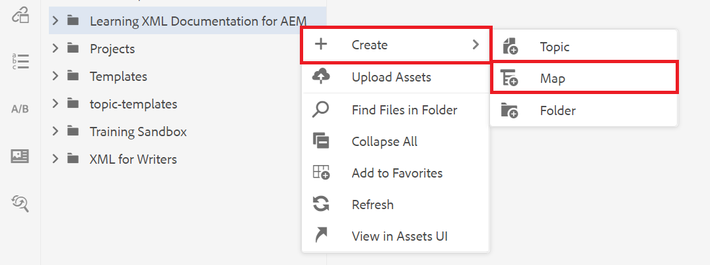
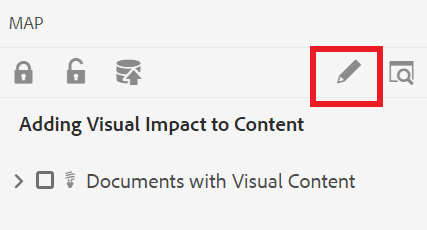

# Crear un mapa

Un mapa es una herramienta organizativa que permite añadir y organizar la información en una estructura jerárquica. Esta tarea muestra cómo crear un mapa y organizar el contenido del mapa.

Puede descargar archivos DITA de ejemplo desde aquí:

* [Documentos-con-contenido-visual.dita](assets/working-with-maps/Documents-with-Visual-Content.dita)
* [Trabajando con tablas.dita](assets/working-with-maps/Working-with-Tables.dita)

>[!VIDEO](https://video.tv.adobe.com/v/336725?quality=12&learn=on)

## Cargar componentes de asignación

Si lo desea, puede cargar archivos de muestra locales en AEM para obtener un conjunto de materiales más completo.

1. Arrastre y suelte los archivos locales en AEM para cargarlos.
1. Repita el proceso según sea necesario para cualquier archivo, incluidas imágenes y temas.

## Creación de un mapa

1. Para abrir el menú [!UICONTROL Opciones], seleccione el icono de puntos suspensivos de la carpeta principal

   

1. Seleccione **[!UICONTROL Crear]** > **[!UICONTROL Mapa]**.

   

   Se muestra el cuadro de diálogo [!UICONTROL Crear nuevo mapa].

1. En el campo [!UICONTROL Plantilla], selecciona **[!UICONTROL Bookmap]** del menú desplegable y asigna un título al mapa.
1. Seleccione **[!UICONTROL Crear]**.

   El mapa se crea y el carril izquierdo cambia automáticamente de la vista Repositorio a la vista Mapa.

## Inserción de componentes de mapa

1. Seleccione el icono de lápiz en el carril izquierdo.

   

   Este es el icono Editar y le permite abrir el mapa en el editor.

1. Vuelva a la vista Repositorio seleccionando el icono Repositorio.

   

1. Añada un tema al mapa arrastrándolo y soltándolo desde el Repositorio al mapa en el editor.

   El indicador de línea muestra dónde se coloca el tema.

1. Siga agregando temas según sea necesario.

## Vista previa de un mapa

La vista previa proporciona una visión rápida del contenido mediante los formatos predeterminados. Muestra los encabezados, párrafos, listas y cualquier otro contenido de los temas que se muestran.

1. Seleccione **[!UICONTROL Vista previa]** en la barra de menús negra superior.

   

El contenido se abre en [!UICONTROL vista previa].

1. Para volver a la vista de autor y reanudar la edición de mapas, seleccione **Autor.**

   

## Configuración de la estructura del mapa

Puede editar la jerarquía de temas dentro del mapa.

1. Haga clic en el icono de un tema para seleccionarlo.
1. Utilice las flechas para degradar y promocionar los elementos respectivamente.

   

## Guarde la asignación como una nueva versión

Ahora que el mapa está completo, puede guardar el trabajo como una nueva versión y registrar los cambios.

1. Seleccione el icono **[!UICONTROL Guardar como nueva versión]**.

   

1. En el campo Comentarios para la nueva versión, introduzca un breve pero claro resumen de los cambios.

1. En el campo Etiquetas de versión, introduzca las etiquetas relevantes.

   Las etiquetas permiten especificar la versión que desea incluir al publicar.

   >[!NOTE]
   > 
   >Si el programa está configurado con etiquetas predefinidas, puede seleccionar una de ellas para garantizar un etiquetado coherente.

1. Seleccione **Guardar**.

   Ha creado una nueva versión del mapa y se actualiza el número de versión.
