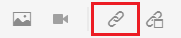
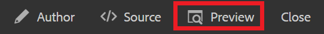
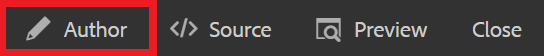

# Vinculación a sitios web

Los vínculos web dirigen a los lectores a sitios web para obtener más información, permitirles interactuar con contenido externo o dar acceso a archivos descargables. A continuación, se muestra cómo agregar un vínculo web a un concepto existente.

>[!VIDEO](https://video.tv.adobe.com/v/336656?quality=12&learn=on)

## Inserción de un vínculo

1. Seleccione el concepto del Repositorio y ábralo en el editor.
1. Añada una cadena de texto al concepto y resáltelo, o resalte el texto existente que desee.

   El vínculo se insertará en el texto resaltado.
1. Seleccione el botón **Insertar referencia cruzada** de la barra de herramientas.

   

   Se muestra el cuadro de diálogo Referencia.

1. Seleccione **Vínculo web** en el menú de la izquierda.
1. Pegue la dirección URL que desee y haga clic en **Seleccionar**.

   El vínculo funciona y abre una página web en una nueva pestaña del explorador al hacer clic.

## Uso de la vista previa para probar vínculos

El botón Preview permite ver una previsualización de un tema. Aquí puede probar los vínculos y verlos como lo haría su audiencia.

1. Seleccione **Vista previa** en la barra de menús negra superior.

   

   El concepto se abrirá en Vista previa.

1. Seleccione el vínculo.
El destino del vínculo se abre en otra pestaña.
1. Vuelva a la vista Autor seleccionando **Autor** en la barra de menú negra superior.

   

## Guardar como nueva versión

Ahora que ha agregado más contenido al concepto, puede guardar el trabajo como una nueva versión y registrar los cambios.

1. Seleccione el icono **Guardar como nueva versión**.

   

1. En el campo Comentarios para la nueva versión, introduzca un breve pero claro resumen de los cambios.
1. En el campo Etiquetas de versión, introduzca las etiquetas relevantes.

   Las etiquetas permiten especificar la versión que desea incluir al publicar.

   >[!NOTE]
   > 
   >Si el programa está configurado con etiquetas predefinidas, puede seleccionar una de ellas para garantizar un etiquetado coherente.

1. Seleccione **Guardar**.

   Ha creado una nueva versión del tema y se actualiza el número de versión.
