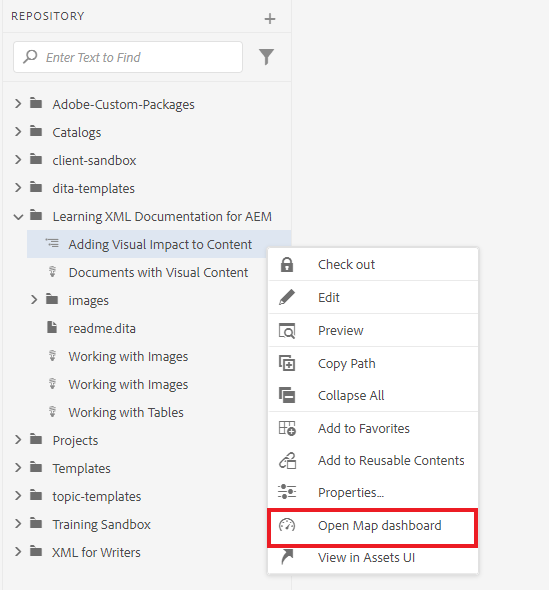
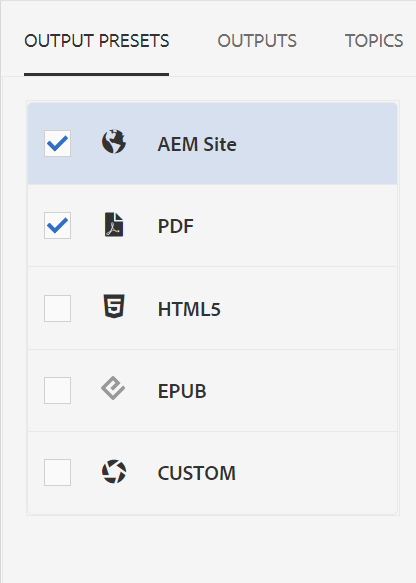
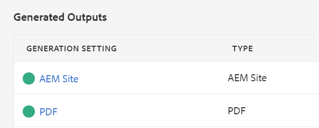

# Publicar salida predeterminada

Una vez que haya completado un mapa, puede publicar el contenido en varios formatos de salida.

>[!VIDEO](https://video.tv.adobe.com/v/336662?quality=12&learn=on)

## Publicación del mapa como sitio de AEM y PDF

Hay una serie de ajustes preestablecidos de salida disponibles para que pueda elegir. Esta guía se centrará en el sitio de AEM y en los resultados de PDF.

1. En el repositorio, seleccione el icono de puntos suspensivos del mapa para abrir el menú Opciones y, a continuación, **Abrir en el panel de mapas.**

   

   El tablero de mapas se abre en otra pestaña.

1. En la pestaña Ajustes preestablecidos de salida, seleccione Sitio de AEM y PDF.

   

1. Seleccione **Generar.**

1. Vaya a la página Resultados para ver el estado de los resultados generados.

   Un círculo verde indica que la generación ha finalizado.

   

## Salida del sitio de AEM

En el resultado del sitio de AEM, AEM publica automáticamente temas, listas, imágenes, títulos, tablas y otro contenido creado con el Editor XML en contenido compatible con la Web.

Puede ver los temas subordinados en la tabla de contenido así como en la sección Información relacionada. Todos estos vínculos se pueden utilizar para navegar.

## La salida de PDF

El documento de PDF terminado contiene el título predeterminado del mapa como título principal de la portada. Las portadas de los capítulos llevan el estilo del número de capítulo y contienen vínculos a los temas incluidos en.
