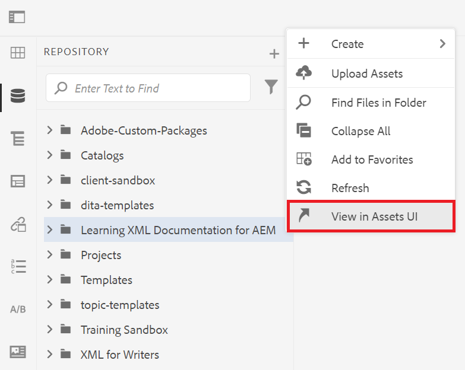
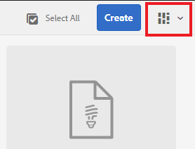

# AEM Explicación de la interfaz de usuario de

Obtenga información sobre la administración de recursos, archivos y carpetas en el Editor XML para Experience Manager.

>[!VIDEO](https://video.tv.adobe.com/v/336659?quality=12&learn=on)

## Acceso al Editor XML

1. En la pantalla de inicio de sesión, escribe tu nombre de usuario y contraseña, y selecciona **[!UICONTROL Iniciar sesión]**.
1. AEM Seleccione **[!UICONTROL Editor XML]** de la página de navegación de la.

## Vistas del editor XML

Desde la barra lateral, puede elegir entre varias vistas para el Editor XML, de modo que se adapte mejor a sus necesidades organizativas. Estas incluyen la vista predeterminada y [!UICONTROL Vista del repositorio].

La vista predeterminada muestra sus [!UICONTROL Favoritos]. Puede personalizarlo aún más con métodos abreviados según sea necesario. A la inversa, la [!UICONTROL vista de repositorio] muestra una estructura de carpetas más tradicional.

### Cambiando a la [!UICONTROL vista de repositorio] desde la vista predeterminada

1. En el carril izquierdo, seleccione **[!UICONTROL Vista de repositorio]**.

   

   Se muestra la [!UICONTROL vista de repositorio].

## La IU de Assets

En la interfaz [!UICONTROL Assets], puede ver

### Visualización de contenido en la IU de Assets

Puede realizar acciones adicionales con el contenido. Una de estas opciones es ver el archivo en la interfaz de usuario de Assets.

1. Pase el ratón sobre una carpeta o tema del repositorio y seleccione el icono de tres puntos que aparece.

   

   Se muestra el menú Opciones.

1. En el menú, seleccione **Ver en la interfaz de usuario de Assets.**

   

### Selección de una vista

Puede elegir entre varias vistas para la interfaz de usuario de Assets que mejor se adapte a sus necesidades organizativas.

1. Seleccione el icono **Cambiar vista** en la esquina superior derecha.

   

   Se muestra un menú desplegable.

1. Seleccione la vista con la que desee trabajar.

### Vistas de IU de Assets

| Nombre | Descripción |
| --- | --- |
| Vista de tarjeta | Muestra cada recurso como un icono |
| Vista de columna | Muestra los recursos en una estructura de carpetas condensada y ampliable |
| Vista de lista    | Muestra los recursos en una lista, junto con sus detalles |

## Volver al Editor XML

Puede volver al Editor XML desde cualquier vista de la interfaz de usuario de Assets.

### Volver de la vista de lista y columna

1. Seleccione el tema que desee editar en la lista.
El tema se muestra en la interfaz de usuario de Assets.
1. Seleccione **Editar** en la barra de herramientas superior.
Volverá al Editor XML.

### Volver de la vista de tarjeta

1. Seleccione el icono de lápiz sobre un tema en la interfaz de usuario de [!UICONTROL Assets].

   

   Volverá al Editor XML.
