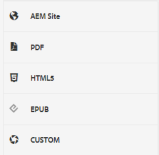

# Valores de salida

Un ajuste preestablecido de salida es una colección de propiedades de publicación que se han asignado a un mapa. Se pueden crear o modificar si es necesario.

>[!VIDEO](https://video.tv.adobe.com/v/338989?quality=12&learn=on)

## Acceso a ajustes preestablecidos de salida

Se muestra un ajuste preestablecido de salida cuando se abre una asignación en el Editor XML en el Tablero de mapas. Los ajustes preestablecidos pueden incluir información sobre un tipo de salida específico, una ruta de destino, instrucciones sobre cómo administrar las páginas de salida existentes y otra configuración que se puede aplicar a un mapa para generar una salida.

## Creación de un ajuste preestablecido de salida

>[!NOTE]
>
>NOTA: Algunas de las funciones utilizadas por un ajuste preestablecido de salida pueden depender del desarrollo primero de una línea base o de un ajuste preestablecido de condición. Si es necesario, debe configurarlos con las pestañas adecuadas.

1. Seleccione un ajuste preestablecido de salida previsto. Por ejemplo, se puede seleccionar AEM o PDF si el nuevo ajuste preestablecido que se va a crear es para un sitio o para proporcionar contenido de Adobe PDF.

1. Haga clic en **Crear**.

1. Si es necesario, seleccione un Tipo de salida.

1. En función del tipo de salida, configure más las opciones.

1. Haga clic en **Listo**.

## Editar un ajuste preestablecido de salida

Los ajustes preestablecidos de salida están predefinidos, pero se pueden personalizar según sea necesario.

1. Abra el tablero de mapas.

1. Seleccione la ficha **Ajustes preestablecidos de salida**.

1. Seleccione un ajuste preestablecido de salida.

1. Haga clic en **Editar**.

1. Modifique la configuración según sea necesario.

   

1. Haga clic en **Listo**.
