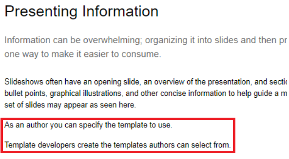
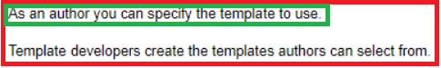
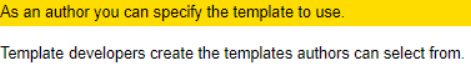
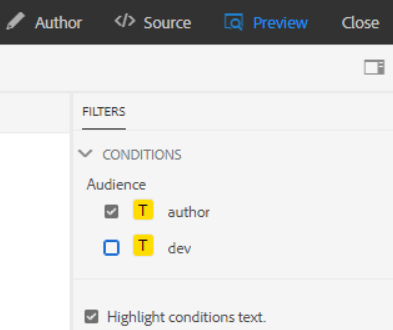
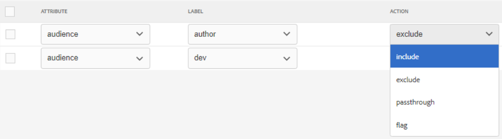
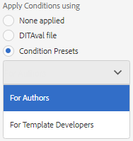
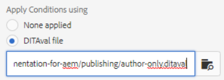

# Publicación con condiciones

La publicación condicional permite escribir una fuente de contenido para una o varias audiencias, productos o plataformas. A continuación, esta información se puede publicar dinámicamente y solo el contenido requerido específicamente incluido en la salida.

>[!VIDEO](https://video.tv.adobe.com/v/339041?quality=12&learn=on)

## Preparación para el ejercicio

Puede descargar archivos de ejemplo para el ejercicio aquí.

[Descarga de ejercicio](assets/exercises/publishing-with-conditions.zip)

## Marcado de contenido con atributos condicionales

1. Abra el tema que desee modificar.

1. Introduzca el texto que se convertirá en condicional. Por ejemplo, uno o más párrafos, una tabla completa, una figura u otro contenido.

   

1. Seleccione el contenido específico al que desea asignar un atributo condicional. Por ejemplo, un solo párrafo dentro del origen.

   

1. En el carril derecho, asegúrese de que se muestra Propiedades.

1. Añada un atributo para audiencia, producto o plataforma.

1. Asigne un valor al atributo. Se han aplicado las actualizaciones de visualización de contenido para mostrar el marcado condicional.

   

## Vista previa del contenido condicional

1. Haga clic en **Vista previa**.

1. En **Filtros**, seleccione o anule la selección de las condiciones para mostrar u ocultar.

1. Seleccione o anule la selección de **Resaltar texto de condiciones**.

   

## Creación de un ajuste preestablecido de condición

Un ajuste preestablecido de condición es una colección de propiedades que definen lo que se va a incluir, excluir o marcar de otro modo durante la generación de resultados.

1. En el tablero de mapas, seleccione la pestaña **Ajustes preestablecidos de condición**.

1. Haga clic en **Crear**.

1. Seleccione **Agregar** (o **Agregar todo**).

1. Asigne un nombre a la condición.

1. Seleccione una combinación de atributo, etiqueta y acción.

   

1. Repita el proceso tantas veces como sea necesario.

1. Haga clic en **Guardar**.

## Generación de resultados condicionales

Una vez aplicadas las condiciones al contenido, se puede generar como salida. Puede utilizar un ajuste preestablecido de condición o un archivo DITAval.

## Generación de resultados condicionales mediante un ajuste preestablecido de condición

1. Seleccione la ficha **Ajustes preestablecidos de salida**.

1. Seleccione un ajuste preestablecido de salida.

1. Haga clic en **Editar**.

1. En **Aplicar condición con**, seleccione un ajuste preestablecido de condición.

   

1. Haga clic en **Listo**.

1. Genere el ajuste preestablecido de salida y revise el contenido.

## Generación de resultados condicionales mediante un fichero DITAval

El fichero DITAval puede utilizarse para publicar contenido condicional. Esto requiere que se cree o cargue un archivo y, a continuación, se haga referencia a él en la publicación.

1. Seleccione la ficha **Ajustes preestablecidos de salida**.

1. Seleccione un ajuste preestablecido de salida.

1. Haga clic en **Editar**.

1. En Aplicar condición usando seleccione un fichero DITAval.

   

1. Haga clic en **Listo**.

1. Genere el ajuste preestablecido de salida y revise el contenido.
