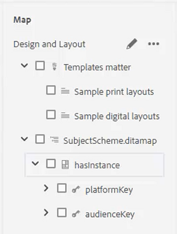

# Condiciones

En DITA, las condiciones suelen depender de atributos como Producto, Plataforma y Audiencia. También pueden tener valores específicos asignados a ellos. Los usuarios pueden controlar todo esto a través de Perfiles de carpeta.

Los archivos de muestra que decida usar para esta lección se proporcionan en el archivo [conditions.zip](assets/conditions.zip).

>[!VIDEO](https://video.tv.adobe.com/v/342755?quality=12&learn=on)

## Asignar condiciones a un perfil de carpeta

1. Seleccione el mosaico **Perfiles de carpeta**.

1. Haga clic en [!UICONTROL **Atributos condicionales**].

1. Haga clic en [!UICONTROL **Editar**] en la esquina superior izquierda del perfil.

1. Haga clic en [!UICONTROL **Agregar**].

   

1. Rellene los campos obligatorios.

   - Name debe corresponder a un atributo utilizado para la generación de perfiles.

   - Valor es la entrada exacta que se utilizará en el origen de código DITA.

   - Label es la palabra que verá el usuario que está introduciendo atributos.

1. Haga clic en [!UICONTROL **Guardar**].

>[!NOTE]
>
>NOTA: La configuración de un perfil global puede ser una forma temprana y eficaz de controlar el uso de atributos y valores para seguir una guía de estilo coherente.

## Asignar atributos a elementos

Si no se ha asignado ningún perfil de carpeta personalizado a un concepto, es posible que desee asignar atributos a elementos específicos, como párrafos.

1. En la **vista de repositorio**, haga clic en el elemento con el que desee trabajar para seleccionarlo.

1. En el panel **Propiedades de contenido**, haga clic en la lista desplegable [!UICONTROL **Atributo**].

1. Elija el atributo que desea asignar.

1. Agregar un **valor**.

El emparejamiento de atributo y valor ahora se asigna al elemento seleccionado.

## Asignar emparejamientos de atributos y valores mediante condiciones

El panel Condiciones permite la asignación controlada de emparejamientos de atributos y valores.

1. Modificar las **Preferencias de usuario**.

   a. Haga clic en el icono Preferencias de usuario.

   

   b. Rellene los campos obligatorios en el cuadro de diálogo **Preferencias de usuario**. Por ejemplo:

   

   c. Haz clic en [!UICONTROL **Guardar**].

1. En el panel de condiciones, expanda los desplegables de Audience and Platform. Tenga en cuenta que las condiciones disponibles son específicas del perfil de la carpeta.

1. Arrastre y suelte una condición en el elemento deseado para asignarla.

## Asignar un esquema de asunto

Los mapas de esquema de asunto son una forma especializada de mapa de datos y se hace referencia a ellos mediante un mapa. Los esquemas de asunto se utilizan para definir taxonomías. Permiten controlar los valores disponibles.

1. Vaya a la **vista de repositorio**.

1. Seleccione un mapa que haga referencia al diagrama de esquema de asunto. Este ejemplo usa el mapa denominado _Diseño y diseño_.

   

1. Configure las preferencias de usuario.

   a. Haga clic en el icono [!UICONTROL **Preferencias de usuario**].

   

   b. Rellene los campos en el cuadro de diálogo **Preferencias de usuario**.

   c. Haga clic en el símbolo de carpeta junto al campo Ruta base para elegir la ruta del archivo deseado.

   d. Haga clic en [!UICONTROL **Seleccionar**].

   e. Haga clic en el símbolo de clave situado junto al campo **Mapa raíz** para escribir una ruta de acceso.

   >[!IMPORTANT]
   >
   >Importante: el mapa raíz seleccionado debe ser el mapa que contenga el esquema de asunto.

   

   f. Restrinja los recursos mostrados seleccionando las carpetas que desee utilizar.

   g. Haga clic en [!UICONTROL **Seleccionar**].

   h. Haz clic en [!UICONTROL **Guardar**].

Se ha asignado el esquema de asunto.

## Ver el esquema de asunto en el panel Condiciones

1. Vaya a **Configuración del editor**.

1. Seleccione la ficha **Condiciones**.

1. Marque la casilla **Mostrar esquema de asunto en el panel Condiciones**
