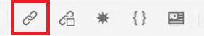
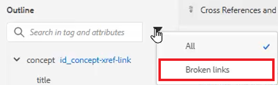

# Referencias cruzadas y vínculos

El Editor XML y DITA proporcionan una forma eficaz de vincular temas. Es importante administrar de forma eficaz las referencias de contenido, y eso incluye trabajar con valores de ID únicos.

En el archivo se proporcionan archivos de ejemplo que puede optar por utilizar para esta lección
[cross-referencesandlinks.zip](assets/crossreferencesandlinks.zip)

>[!VIDEO](https://video.tv.adobe.com/v/342764?quality=12&learn=on)

## Creación de una referencia cruzada a un tema externo

Es posible crear una referencia cruzada externa arrastrando y soltando un tema del Repositorio en un fichero abierto. Sin embargo, para evitar que se rompan las referencias cruzadas, primero debe definirse un ID a un valor relacionado con el elemento principal. Esta es una manera sencilla de crear una referencia cruzada a la vez que se garantiza que los ID se asignan correctamente.

1. Abra un archivo en el que desee insertar una referencia cruzada externa.

1. Asigne un ID al elemento al que se hará referencia.

   a. Haga clic dentro del elemento.

   b. En el panel Propiedades de contenido, elija **ID** en la lista desplegable Atributo.

   c. Escriba un nombre lógico en el campo Valor.

   d. Vea el elemento y su valor en **Vista de esquema** si lo desea.

1. **Guarde** el tema para asegurarse de que el repositorio tenga el ID actualizado.

1. Haga clic en el icono [!UICONTROL **Referencia**] en la barra de herramientas superior.

   

1. En la ficha **Referencia de contenido**, seleccione el emparejamiento de elemento e ID que desee insertar como referencia cruzada.

1. Haga clic en [!UICONTROL **Seleccionar**].

Se ha añadido la referencia cruzada al tema.

## Vínculo a un sitio web

Puede insertar un vínculo a un sitio web dentro de cualquier tema. Consulte el vídeo del curso 1 de AEM Guides sobre vinculación a sitios web para obtener más información.

## Ver vínculos rotos

Algunas modificaciones pueden provocar que se rompan las referencias cruzadas. Estos incluyen eliminar un tema, reorganizar una sección que contiene una referencia cruzada o cambiar un ID después de insertar la referencia cruzada. Tenga en cuenta que con esta lección se proporciona un tema de ejemplo _cross-referencesandlinks.zip_ que hará que se rompan varias de las referencias cruzadas con viñetas del contenido interno.

1. Vaya a la **Vista de esquema** en el panel izquierdo.

1. Haga clic en el icono [!UICONTROL **Filtro**].

1. Seleccionar **vínculos rotos**.

   

Los vínculos rotos se muestran como objetos en los que se puede hacer clic. Puede identificarlos con texto rojo en el tema.
