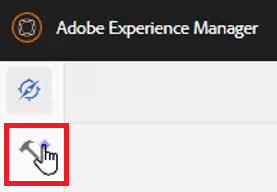
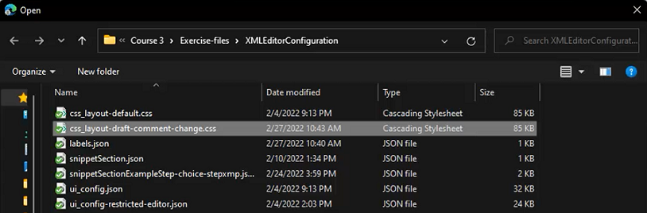
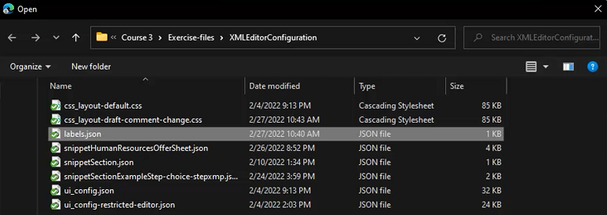

# Configuración del editor XML

Si trabaja en un entorno restrictivo, puede elegir las funciones que los autores pueden ver personalizando la Configuración del editor dentro de un perfil de carpeta específico. La aplicación de este perfil de carpeta puede cambiar la apariencia del editor en sí, las plantillas CSS, los fragmentos disponibles y las etiquetas de versión de contenido.

Los archivos de muestra que decida usar para esta lección se proporcionan en el archivo [xmleditorconfiguration.zip](assets/xmleditorconfiguration.zip).

>[!VIDEO](https://video.tv.adobe.com/v/342762?quality=12&learn=on)

## Personalizar la configuración predeterminada de la interfaz de usuario del editor

Siempre puede descargar la configuración de interfaz de usuario predeterminada en el sistema local, realizar cambios en el editor de texto que desee y cargarla de nuevo.

1. En la pantalla Navegación, haga clic en el icono [!UICONTROL **Herramientas**].

   

1. Seleccione **Guías** en el panel izquierdo.

1. Haga clic en el mosaico [!UICONTROL **Perfiles de carpeta**].

   

1. Seleccione un perfil de carpeta.

1. Haga clic en la ficha [!UICONTROL **Configuración del editor XML**].

1. Haga clic en [!UICONTROL **Descargar**] predeterminado.

   

Ahora puede abrir y modificar el contenido en un editor de texto. La Guía de instalación y configuración de _AEM Guides_ contiene ejemplos de cómo quitar, personalizar o agregar funciones a la configuración de la interfaz de usuario.

## Cargar la configuración modificada del editor XML

Después de personalizar la configuración de la interfaz de usuario, puede cargarla. Tenga en cuenta que se proporciona un archivo de configuración de muestra _ui-config-restrict-editor.json_ con el conjunto de temas de compatibilidad para esta lección.

1. En el perfil de carpeta, haga clic en la ficha [!UICONTROL **Configuración del editor XML**].

1. En la configuración del Editor XML, haga clic en [!UICONTROL **Cargar**].

   

1. Haga doble clic en el archivo para la configuración de la interfaz de usuario modificada o, como se muestra aquí, en el archivo de muestra proporcionado.

   

1. Haz clic en [!UICONTROL **Guardar**] en la esquina superior izquierda de la pantalla.

La configuración de la IU modificada se ha cargado correctamente.

## Personalizar el diseño de la plantilla CSS

Al igual que con la configuración de la interfaz de usuario, puede descargar el diseño de la plantilla CSS. Puede abrirlo en un editor de texto y realizar modificaciones para personalizar el aspecto del tema antes de cargarlo.

1. En la pantalla Navegación, haga clic en el icono [!UICONTROL **Herramientas**].

   

1. Seleccione **Guías** en el panel izquierdo.

1. Haga clic en el mosaico [!UICONTROL **Perfiles de carpeta**].

   

1. Seleccione un perfil de carpeta.

1. Haga clic en la ficha [!UICONTROL **Configuración del editor XML**].

1. En Diseño de plantilla CSS, haga clic en [!UICONTROL **Descargar**].

   

Ahora puede modificar y guardar el contenido CSS en un editor de texto.

## Cargar el diseño de plantilla CSS modificado

Después de personalizar el diseño de la plantilla CSS, puede cargarla. Tenga en cuenta que se proporciona un archivo de muestra _css-layout-ONLY-draft-comment-change.css_ con el conjunto de temas de apoyo para esta lección. Este archivo contiene solamente el cambio de comentario de borrador, mientras que _css-layout-draft-comment-change.css_ es el archivo completo, disponible solo para pruebas o revisiones.

1. En el perfil de carpeta, haga clic en la ficha [!UICONTROL **Configuración del editor XML**].

1. En Diseño de plantilla CSS, haga clic en [!UICONTROL **Cargar**].

   

1. Haga doble clic en el archivo para su propio diseño CSS personalizado o en el archivo de ejemplo proporcionado que se muestra aquí.

   

1. Haz clic en [!UICONTROL **Guardar**] en la esquina superior izquierda de la pantalla.
Ha cargado correctamente el diseño de plantilla CSS personalizado.

## Editar fragmentos de código del editor XML

Los fragmentos de código son fragmentos de contenido reutilizables que pueden ser específicos de un producto o grupo. Tenga en cuenta que los fragmentos de código de ejemplo se proporcionan con los archivos de compatibilidad para esta lección.

1. En la pantalla Navegación, haga clic en el icono [!UICONTROL **Herramientas**].

   

1. Seleccione **Guías** en el panel izquierdo.

1. Haga clic en el mosaico [!UICONTROL **Perfiles de carpeta**].

   

1. Seleccione un perfil de carpeta.

1. Haga clic en la ficha [!UICONTROL **Configuración del editor XML**].

1. En Fragmentos del editor XML, haga clic en **Cargar**.

   

1. Elija sus propios fragmentos de código o utilice los ejemplos proporcionados.

   

1. Haz clic en [!UICONTROL **Guardar**] en la esquina superior izquierda de la pantalla.

Se han añadido correctamente nuevos fragmentos de código al editor.

## Personalizar etiquetas de versión de contenido XML

De forma predeterminada, los autores pueden crear etiquetas de su elección y asociarlas a archivos de temas. Esto puede producir diferentes variaciones en la misma etiqueta. Para evitar un etiquetado incoherente, también puede elegir entre listas de etiquetas predefinidas.

1. En la pantalla Navegación, haga clic en el icono [!UICONTROL **Herramientas**].

   

1. Seleccione **Guías** en el panel izquierdo.

1. Haga clic en el mosaico [!UICONTROL **Perfiles de carpeta**].

   

1. Seleccione un perfil de carpeta.

1. Haga clic en la ficha [!UICONTROL **Configuración del editor XML**].

1. En Etiquetas de versión de contenido XML, haga clic en [!UICONTROL **Descargar**].

   

Ya está listo para personalizar las etiquetas según sea necesario.

## Cargar etiquetas de versión de contenido XML

Una vez que haya descargado y modificado las etiquetas, puede cargar el tema Etiqueta de versión de contenido XML. Puede elegir usar el archivo de muestra _labels.json_, que se proporciona con el conjunto de temas de compatibilidad para esta lección.

1. En el perfil de carpeta, haga clic en la ficha [!UICONTROL **Configuración del editor XML**].

1. En Etiquetas de versión de contenido XML, haga clic en [!UICONTROL **Cargar**].

   

1. Haga doble clic en el archivo para sus propias etiquetas personalizadas o en el archivo de ejemplo proporcionado que se muestra aquí.

   

1. Haz clic en [!UICONTROL **Guardar**] en la esquina superior izquierda de la pantalla.

Ha cargado correctamente etiquetas de versión de contenido XML personalizadas.
