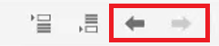
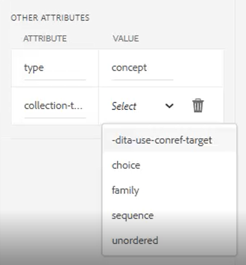

# Mapas y marcadores

El editor de mapas de Adobe Experience Manager Guides le permite crear y editar archivos de mapa. Con el Editor de mapas, se pueden editar dos tipos de ficheros: DITA map y bookmap. Para nuestros fines, consideremos que estos son conceptos en gran medida intercambiables.
El Editor de Mapas viene en dos modos: el Editor de Mapas Básico y el Editor de Mapas Avanzado.

>[!VIDEO](https://video.tv.adobe.com/v/342766?quality=12&learn=on)

## Creación de un mapa

AEM Guides proporciona dos plantillas de mapas integradas: mapa DITA y mapa de libros. También puede crear sus propias plantillas de mapa y compartirlas con sus autores para crear archivos de mapa.

Realice los siguientes pasos para crear un archivo de asignación.

1. En la interfaz de usuario de Assets, vaya a la ubicación en la que desea crear el archivo de asignación.

1. Haga clic en [!UICONTROL **Crear > Mapa DITA**].

1. En la página Modelo, seleccione el tipo de plantillas de mapa que desee usar y haga clic en [!UICONTROL **Siguiente**].

1. En la página Propiedades, escriba un **Título** y un **Nombre** para el mapa.

1. Haga clic en [!UICONTROL **Crear**].

## Apertura de un mapa con el Editor de mapas avanzado

1. En la **interfaz de usuario de Assets**, seleccione el mapa que desea editar.

1. Haga clic en [!UICONTROL **Editar temas**].

   

O bien

1. Pase el ratón sobre el icono del mapa.

1. Seleccione **Editar temas** del menú **Acción**.

## Adición de contenido a un mapa o un mapa

1. Vaya a la **vista de repositorio**.

1. Arrastre y suelte el contenido de la vista de repositorio en ubicaciones válidas del mapa o del bookmap.

O bien

1. Haga clic en una ubicación válida dentro del mapa o del mapa.

1. Haga clic en el [!UICONTROL **icono de la barra de herramientas**] apropiado para agregar capítulos, temas o referencias de temas.

   

1. Elija uno o más Assets que desee agregar.

1. Haga clic en [!UICONTROL **Seleccionar**].

### Promocionar o degradar elementos en un mapa

Use **Flechas de la barra de herramientas** para promocionar o degradar capítulos y temas en un mapa o un mapa de libros.

1. Seleccione un elemento en el mapa.

1. Haga clic en la [!UICONTROL **flecha izquierda**] para promocionar un tema a un capítulo, o en la [!UICONTROL **flecha derecha**] para degradar un capítulo a un tema.

   

1. Guarde y convierta a versión la asignación si es necesario.

O bien

1. Arrastre y suelte los elementos para reorganizarlos.

## Adición de metadatos a un mapa

1. En la barra de herramientas **Map**, inserte un grupo de temas.

   

1. Haga clic en el icono [!UICONTROL **Más**] para insertar elementos.

1. Seleccione los elementos que desee insertar.

   

1. Haga clic en [!UICONTROL **Cerrar**].

## Adición de un elemento relacionado a un mapa

Se puede agregar un objeto reltable después de estructurar un mapa.

1. Haga clic en el mapa en el que desee insertar el reltable.

1. Use el **Icono de la barra de herramientas** para agregar el elemento relacionado al mapa.

   

1. Configure el cuadro de diálogo.

1. Haga clic en [!UICONTROL **Insertar**].

1. Arrastre y suelte los temas necesarios del **Repositorio** en la tabla de informes.

1. Copie y pegue los elementos necesarios del mapa en el reltable mediante métodos abreviados de teclado estándar.

## Asignar atributos a referencias de tema en un mapa

1. Resalte una colección de topicref o una colección anidada de topicrefs en el mapa.

1. En Otros atributos en el panel Propiedades del contenido, elija un **Atributo** y su **Valor.**

   
