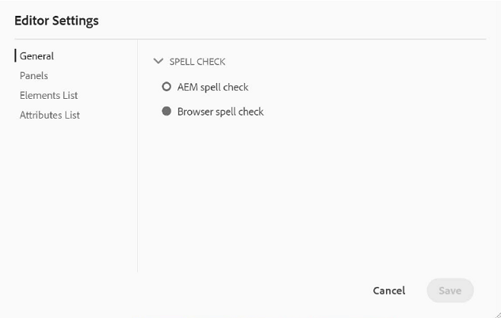
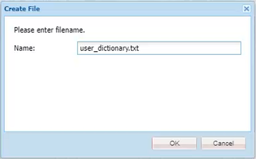

# Corrección ortográfica y Buscar/reemplazar

El editor de AEM Guides tiene potentes funciones de revisión ortográfica y de búsqueda y reemplazo.

>[!VIDEO](https://video.tv.adobe.com/v/342768?quality=12&learn=on)

Corregir un error ortográfico

1. Busque un error en un tema abierto, que se muestra con un subrayado rojo.

1. Mantenga pulsado Ctrl + clic en el botón secundario del ratón dentro de la palabra.

1. Elija la ortografía correcta entre las sugerencias.

Si no se sugiere la ortografía correcta, siempre puede editar la palabra manualmente.

## AEM Cambiar a comprobación de ortografía de

Es posible que desee utilizar una herramienta de revisión ortográfica que no sea el diccionario predeterminado del explorador.

1. Vaya a **Configuración del editor**.

1. Seleccione la ficha de configuración **General**.

   

1. Hay dos opciones:

   - **Revisión ortográfica del explorador**: la configuración predeterminada en la que la revisión ortográfica utiliza el diccionario integrado del explorador.

   - AEM AEM **revisión ortográfica de la**: use esto para crear una lista de palabras personalizada usando el diccionario personalizado de la aplicación de escritura de la aplicación.

1. AEM Elija **Corrección ortográfica de la**.

1. Haga clic en [!UICONTROL **Guardar**].

Configurar un diccionario personalizado

AEM El administrador puede cambiar la configuración para que el diccionario de la aplicación reconozca palabras personalizadas, como nombres de empresas.

1. Vaya al panel **Herramientas**.

1. Inicie sesión en **CRXDE Lite**.

   AEM 

1. Vaya al nodo **_/apps/fmdita/config_**.

   

1. Cree un nuevo archivo.

   a. Haga clic con el botón derecho en la carpeta de configuración.

   b. Elija **Crear > Crear archivo**.

   

   c. Asigne un nombre al archivo _**user_dictionary.txt**_.

   

   d. Haz clic en [!UICONTROL **Aceptar**].

1. Abra el archivo.

1. Agregue una lista de palabras que desee incluir en el diccionario personalizado.

1. Haga clic en [!UICONTROL **Guardar todo**].

1. Cierre el archivo.

AEM Es posible que los autores tengan que reiniciar su sesión del Editor Web para obtener la lista de palabras personalizada actualizada en el Diccionario de palabras de la aplicación de la aplicación de la aplicación de la aplicación de código de la aplicación de la aplicación de.

## Buscar y reemplazar en un solo archivo

1. Haga clic en el icono Buscar y reemplazar de la barra de herramientas superior.

   

1. En la barra de herramientas inferior, escriba una palabra o frase.

1. Haga clic en [!UICONTROL **Buscar**].

1. Si es necesario, escriba una palabra para reemplazar la palabra encontrada.

1. Haga clic en [!UICONTROL **Reemplazar**].

## Buscar y reemplazar en todo el repositorio

1. Vaya a **Repositorio**.

1. Haz clic en el icono [!UICONTROL **Buscar y reemplazar**] en la parte inferior izquierda de la pantalla.

1. Haga clic en el icono [!UICONTROL **Mostrar configuración**].

1. Elija una de estas opciones

   - **Desproteger archivo antes de reemplazar**: si lo habilita un administrador, el archivo se desprotegerá automáticamente antes de reemplazar los términos de búsqueda.

   - **Sólo palabra completa**: restringe la búsqueda para que devuelva únicamente la palabra o frase exacta introducida.

   

1. Haga clic en el icono [!UICONTROL **Aplicar filtro**] para seleccionar la ruta de acceso del repositorio en la que desea realizar la búsqueda.

1. Introduzca los términos que desea buscar y reemplazar.

1. Si es necesario, seleccione **Crear nueva versión después de reemplazar**.

1. Haga clic en [!UICONTROL **Buscar**].

1. Abra el archivo deseado y utilice las flechas para desplazarse de un resultado encontrado al siguiente.

   
